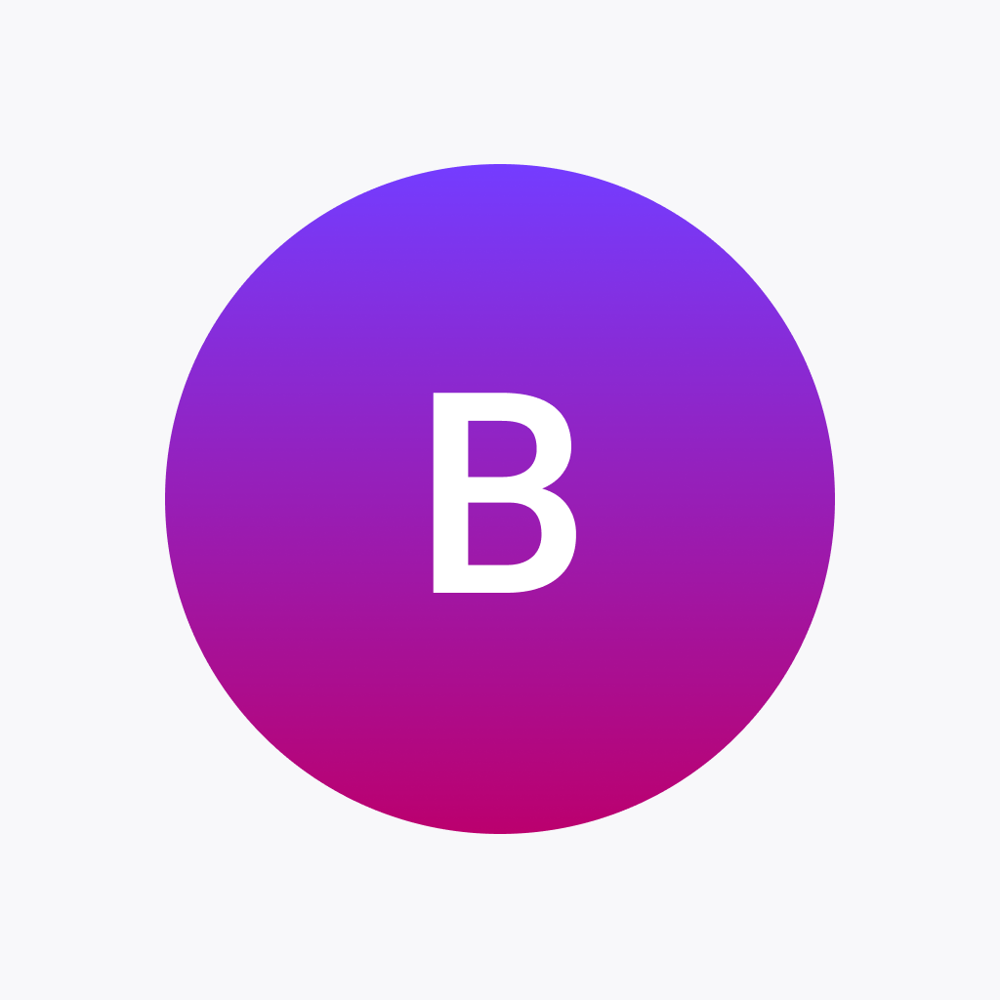

<div id="top"></div>

[![MIT License][license-shield]][license-url]

<!-- PROJECT LOGO -->
<br />
<div align="center">
  <a href="https://github.com/smbrmoyo/BallerMapMVP">
    
  </a>

<h3 align="center">BallerMap</h3>

  <p align="center">
    Ball wherever you want
    <br />
    <a href="https://github.com/smbrmoyo/BallerMapMVP"><strong>Explore the docs »</strong></a>
    <br />
    <br />
  </p>
</div>

<!-- TABLE OF CONTENTS -->
<details>
  <summary>Table of Contents</summary>
  <ol>
    <li>
      <a href="#about-the-project">About The Project</a>
      <ul>
        <li><a href="#built-with">Built With</a></li>
      </ul>
    </li>
    <li>
      <a href="#getting-started">Getting Started</a>
      <ul>
        <li><a href="#prerequisites">Prerequisites</a></li>
        <li><a href="#installation">Installation</a></li>
      </ul>
    </li>
    <li><a href="#contributing">Contributing</a></li>
    <li><a href="#license">License</a></li>
    <li><a href="#contact">Contact</a></li>
  </ol>
</details>

<!-- ABOUT THE PROJECT -->

## About The Project

BallerMap is an app that uses the location ton find basketball courts near a given user. It also enables you to create events on said courts, as well as invite friends and notify them whenever you're ready to play.

### Built With

- [Expo](https://expo.dev)
- [EAS](https://expo.dev/eas)
- [AWS Amplify](https://aws.amazon.com/amplify)

<!-- GETTING STARTED -->

## Getting Started

If you wish to run the project locally:

### Prerequisites

Install the latest version of npm.

- npm
  ```sh
  npm install npm@latest -g
  ```

### Installation

1. Clone the repo:
   ```sh
   git clone https://github.com/smbrmoyo/BallerMapMVP.git
   ```
2. Install npm packages:
   ```sh
   npm install
   ```
3. Start the development server:
   ```js
   npm start
   ```

<!-- CONTRIBUTING -->

## Contributing

Contributions are what make the open source community such an amazing place to learn, inspire, and create. Any contributions you make are **greatly appreciated**.

If you have a suggestion that would make this better, please fork the repo and create a pull request. You can also simply open an issue with the tag "enhancement".
Don't forget to give the project a star! Thanks again!

1. Fork the Project
2. Create your Feature Branch (`git checkout -b feature/AmazingFeature`)
3. Commit your Changes (`git commit -m 'Add some AmazingFeature'`)
4. Push to the Branch (`git push origin feature/AmazingFeature`)
5. Open a Pull Request

<!-- LICENSE -->

## License

Distributed under the MIT License. See `LICENSE.txt` for more information.

<!-- CONTACT -->

## Contact

Brian Moyou - [@brianmoyou1](https://twitter.com/@brianmoyou1) - brianmoyou@gmail.com

Project Link: [https://github.com/smbrmoyo/BallerMapMVP](https://github.com/smbrmoyo/BallerMapMVP)

<p align="right">(<a href="#top">back to top</a>)</p>

<!-- MARKDOWN LINKS & IMAGES -->
<!-- https://www.markdownguide.org/basic-syntax/#reference-style-links -->

[license-shield]: https://img.shields.io/github/license/smbrmoyo/BallerMapMVP?label=License
[license-url]: https://img.shields.io/github/license/smbrmoyo/BallerMapMVP?label=License
